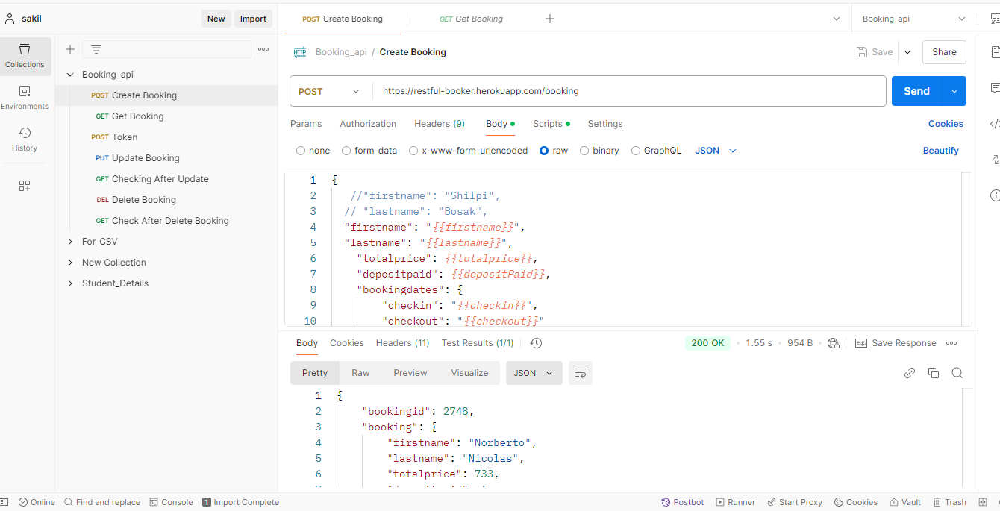
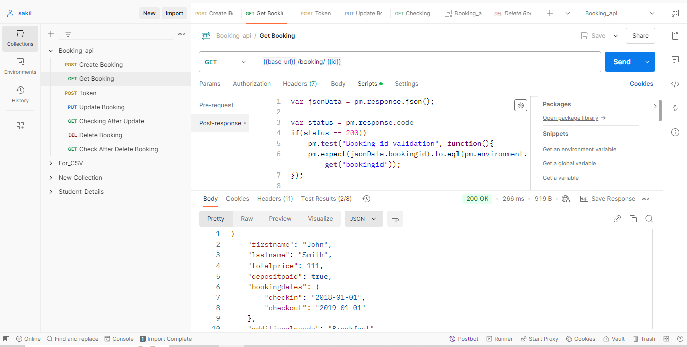
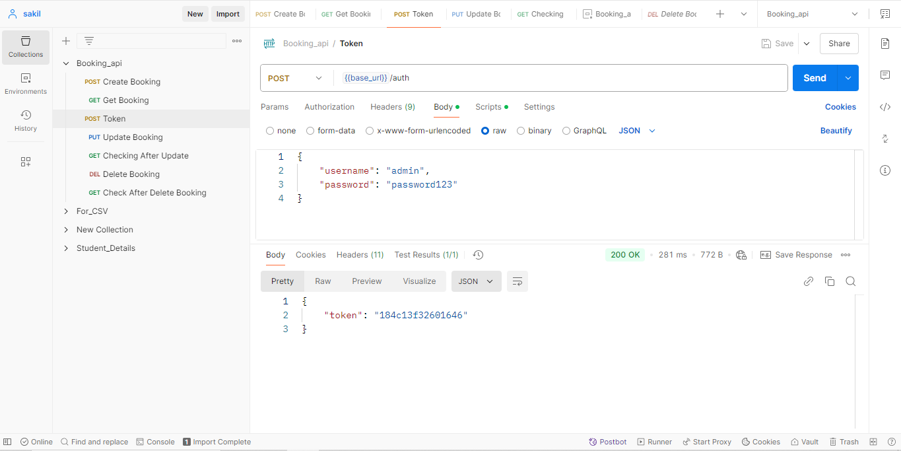
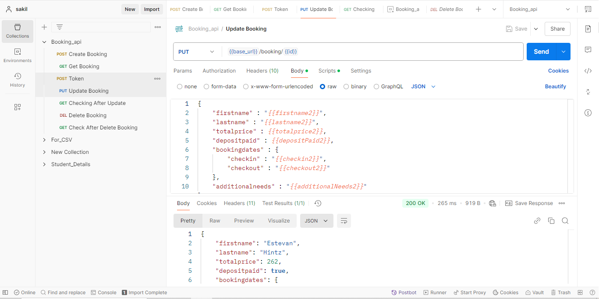
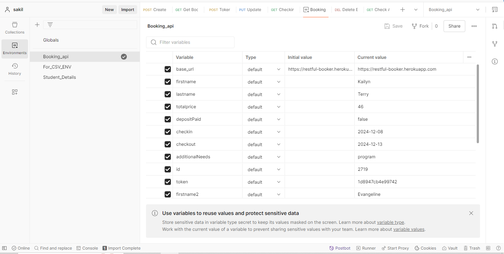
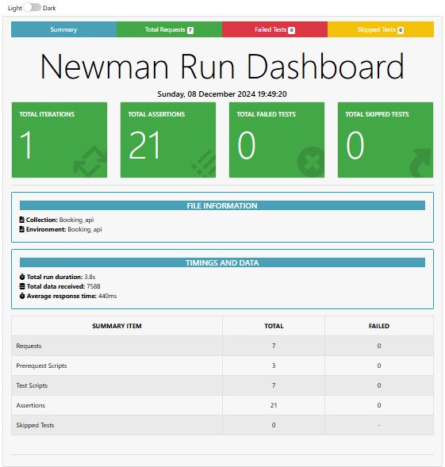

# **API Testing Project: Booking_API**

This repository showcases API testing for booking functionalities using Postman and Newman. The focus is on creating, retrieving, updating, and deleting bookings through specific API endpoints.

## **Testing Tools:**

**Postman:** Used for sending API requests, managing test collections, and inspecting responses.

**Newman:**  Utilized for running tests from the command line and generating reports in different formats (e.g., HTML, JSON).

## **Testing Coverage:**

#### **CRUD Operations:** The project encompasses tests for the following functionalities -

Create Booking (POST)

Get Booking (GET)

Token (POST)

Update Booking (PUT)

Checking After Update(GET)

Delete Booking(DELETE)

Checking After Delete Booking (GET)

**Booking_Id_api_tests:** This file describes the API testing project.

**Postman_Collections:** This folder holds Postman collections for different testing scenarios.

**Newman_Report:** This folder contains Newman-generated test reports.

## **Create_Booking**
Create Booking is typically used to send a POST request to a server to create a new booking or reservation. This POST request includes the necessary data (such as Guest details, Price, Dates, Needs etc.) in the request body, allowing the server to process and create a new booking entry in its database.

## **GET method**
In Postman, a GET method is used to retrieve data from a server or API endpoint. It fetches information from the server without modifying anything, allowing users to view or read data such as user profiles, product listings, or any other resource available on the server.

## **User_Auth(Token)**
In Postman, an Auth method is used to authenticate and authorize access to protected resources on a server or API endpoint. It allows users to include authentication tokens, API keys, or credentials in the request headers to verify their identity and gain access to restricted data or operations.

## **Update_Booking**
 Update method is used to send a PUT or PATCH request to a server to modify existing data or resources. It allows users to update specific fields or properties of a resource without replacing the entire resource, ensuring efficient and targeted updates to the server's data.
 
 

## **Verify_Update**
verify update request API" is used to confirm the successful update of a resource. It involves sending a PUT or PATCH request to modify the resource and then sending a subsequent GET request to ensure that the changes have been applied correctly on the server. This verification step helps ensure the accuracy and completion of the update process.

 

## **Delete_Booking**
Delete method is used to send a request to a server or API endpoint to remove a specific resource. It allows users to delete data entries, records, or other resources from the server's database or storage, effectively removing them from the system.

 
 

## **Postman_Environment**
Environment is used to store and manage variables that can be used across requests in a collection. It allows users to define values such as URLs, API keys, and authentication tokens once and use them dynamically in multiple requests, making it easier to manage and maintain API tests and configurations.

 

## **Newman_Report**
Newman report" feature is used to generate detailed test reports for API collections run using the Newman command-line tool. It provides a summary of test results, including pass/fail statuses, response times, and error details, allowing users to analyze and share test results with team members or stakeholders.

 

## **Newman_RunCommand**
Newman Run Command is used to execute API collections from the command line using the Newman tool. It allows users to automate the execution of tests, run them in CMD pipelines, and generate detailed reports, enhancing the efficiency and scalability of API testing processes.

## **newman run Booking_api.postman_collection.json -e Booking_api.postman_environment.json -r cli,html**

## **newman run Booking_api.postman_collection.json -e Booking_api.postman_environment.json -r cli,htmlextra**

